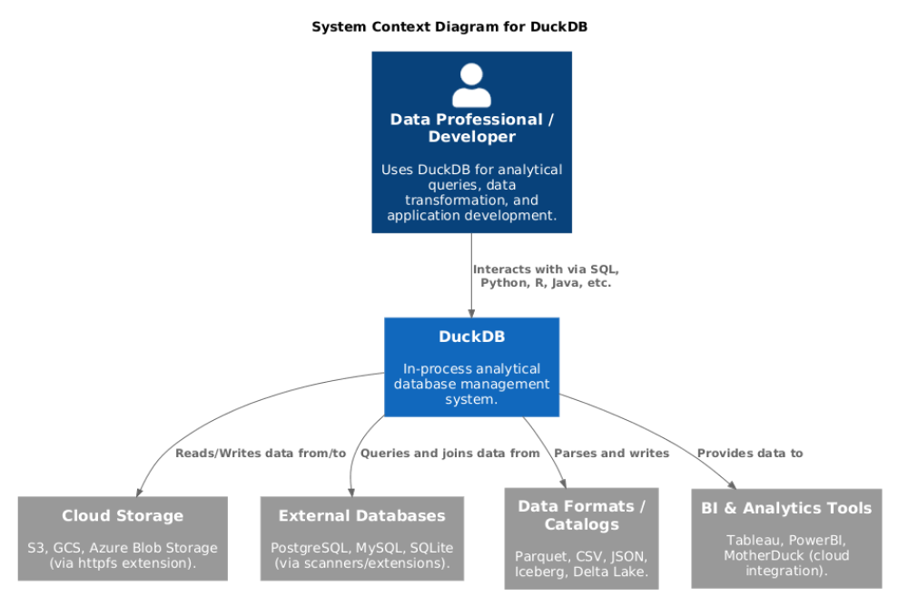
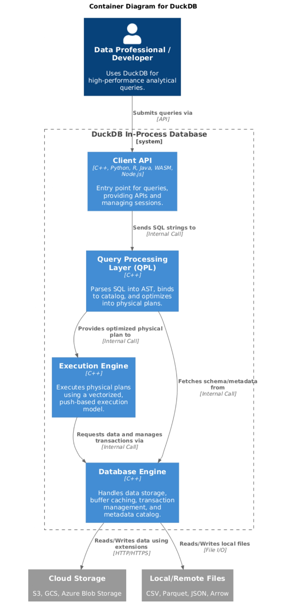
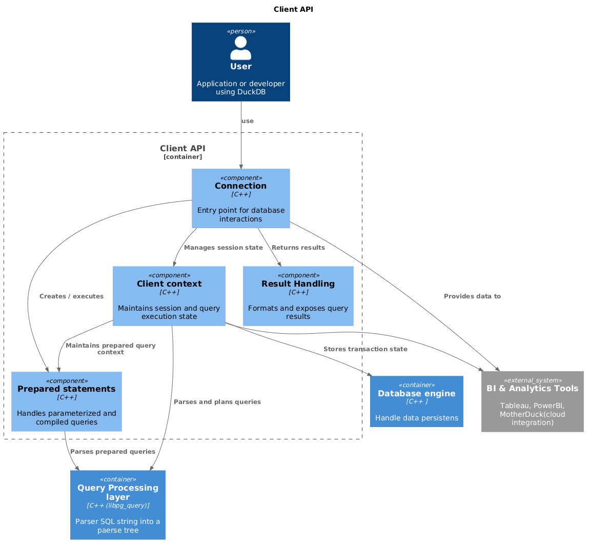
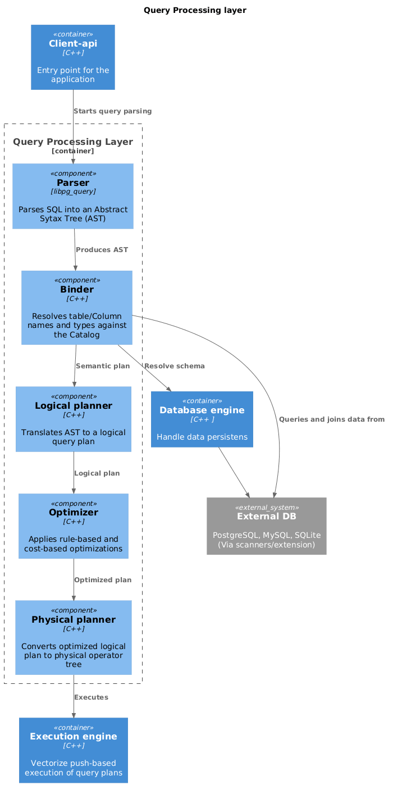
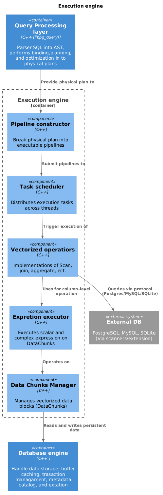
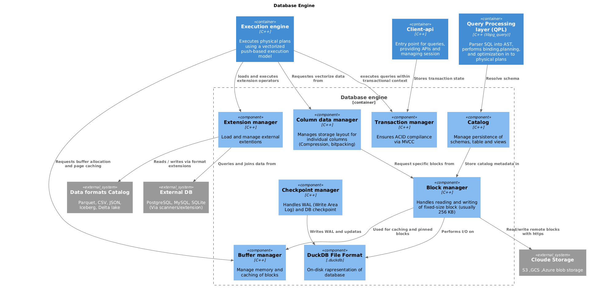
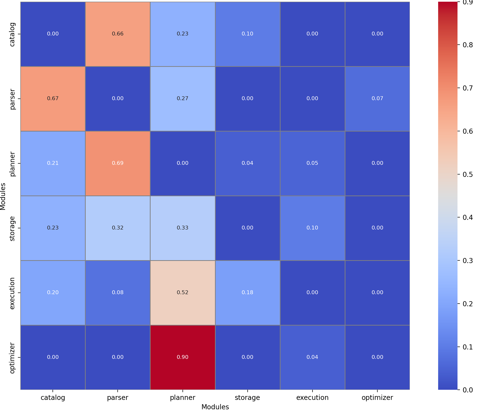

# Software Architecture Report

## 1. Introduction 
This document provides a comprehensive overview of the software architecture of DuckDB, an in-process analytical database management system. The architecture is documented using the C4 model to describe the system at different levels of abstraction. The diagrams in this report were created using **PlantUML** in conjunction with the **C4-PlantUML** library and managed via **c4builder**.

## 2. First level: Context level
The Context Level diagram illustrates DuckDB at a high level, showing its interactions with users and external systems. As an in-process analytical database, it is primarily used by Data Professionals and Developers for analytical queries, data transformations, and application development. DuckDB interacts with various external elements such as Cloud Storage (like S3, GCS, Azure Blob Storage via httpfs), other External Databases (like PostgreSQL, MySQL, SQLite via extensions), various Data Formats (Parquet, CSV, JSON, Iceberg), and BI & Analytics Tools (Tableau, PowerBI, MotherDuck).

## 3. Second level: Container level
The Container Level diagram breaks down the DuckDB system into four core internal containers: Client API, Query Processing Layer (QPL), Execution Engine, and Database Engine.

- **Client API**: Acts as the entry point for applications across multiple languages (Python, R, Java, C++, WASM, Node.js), receiving queries and orchestrating sessions.
- **Query Processing Layer (QPL)**: Combines the parser, planner, and optimizer. It parses SQL into an Abstract Syntax Tree (AST), binds the variables by querying the Database Engine (Catalog), and translates the AST into a highly optimized physical execution plan.
- **Execution Engine**: Receives the physical plan from the QPL and executes it using a highly efficient vectorized, push-based execution model. 
- **Database Engine**: Encapsulates data management, including the Storage Manager, Buffer Manager, Transaction Manager (for MVCC), Catalog, and Extensions. It serves metadata to the QPL and data blocks to the Execution Engine.

## 4. Third level: Component level
### 4.1 Client API
The Client API, the entry point of the system, is composed of several components. The first one encountered is the Connection component, which is responsible for providing the user with all the APIs needed to use the application. In addition, it is responsible for orchestrating all the other components and managing the session.

The rest of the responsibilities are mainly delegated to the Client Context, the true core of the system, which coordinates query management: it invokes the parser, prepares queries with the help of the Prepared Parser, and handles transactions by relying on the Database Engine. It can also be considered the controller of the query.

The Prepared Parser avoids executing the parser for every query. This is particularly useful in the case of parameterized queries, where the query is built once and reused by only changing the parameters each time. This leads to a reduction in cost.

The Result Handling component, the last one analyzed, is responsible for translating the results into formats that are useful for the user, such as objects or tables.

### 4.2 Query Processing Layer
The Client API interfaces, through the Client Context, with the Query Processing Layer (QPL). The interaction begins with the Parser, a component responsible for constructing the Abstract Syntax Tree (AST) from the query. It is based on the libpg_query library written in C.

Afterwards, the Binder comes into play, a component designed to translate the AST into a semantic representation by resolving tables, columns, and similar elements, also relying on the Database Engine by consulting the Catalog.

In the subsequent steps, the Logical Planner, Optimizer, and Physical Planner are encountered in order. These components are used to obtain an optimized operator tree based on rules and cost-based comparison. It is important to note that first a logical tree is produced, which is then optimized, and only afterwards is the physical plan generated, defining how data is accessed.

### 4.3 Execution Engine
The physical plan is passed to the Execution Engine, specifically to the Pipeline Constructor, which is responsible for creating a pipeline, identifying dependencies, and determining which operations can be executed in parallel and which cannot.

The next component, the Task Scheduler, assigns and manages threads based on the outcome of the pipeline.

The implementation of each operation is handled by the Vectorized Operators, which also perform vectorization of data elements, providing significant benefits in terms of resource utilization.

The actual execution of operations is delegated to the Expression Executor, which separates all computable parts and manages the various operations.

Another very important component is the Data Chunks Manager (DCM), which handles memory batches and allocates vectors, the fundamental unit of execution.

It is worth noting that the last analyzed containers follow a pipeline-based architecture.

### 4.4 DataBase Engine
The Data Chunks Manager (DCM) interacts with the Database Engine to efficiently manage physical data, primarily interfacing with the Column Data Manager (CDM), which is responsible for data storage and management, and heavily relies on the Block Manager for reading and writing operations.

To accomplish this, it interacts with several components: the DuckDB File Format, which represents the database stored on disk; the Buffer Manager, which is used to access the most frequently used data blocks; and external cloud storage in case of necessity.

Another component connected to the Block Manager is the Catalog, which is queried by the QPL. It is responsible for maintaining the database metadata.

The last analyzed components are the Checkpoint Manager, Transaction Manager, and Extension Manager.

The Checkpoint Manager handles log files that are useful for database recovery. In fact, changes in the database are first written to the log file and then to the .duckdb file.

The Transaction Manager is invoked by the Client API to support atomic operations and ensure data consistency, while the Extension Manager is responsible for integrating additional software functionalities when needed, keeping the core system lightweight.

### 4.5 SOLID & component principle and conclusion
Regarding the SOLID principles, the first one analyzed is the Single Responsibility Principle (SRP). It emerges that the components are well separated according to their responsibilities; in fact, it is clear what each component is responsible for, and they are not overly complex. However, some violations of this principle still exist, such as in the Vectorized Operators, which also handle memory management. This design choice was made for simplicity and performance optimization.

The second principle observed is the Open/Closed Principle (OCP), which is fairly well respected in higher-level components such as the planner. However, it becomes less respected as one moves down the stack, due to strong coupling in the code. An example is the Checkpoint Manager, since the .duckdb file format is highly specific and would require cross-cutting changes involving other components such as the Catalog.

The third principle analyzed is the Liskov Substitution Principle (LSP), which is respected mainly at the logical level, such as in the Planner and Optimizer, which operate in a highly abstract manner. However, it is violated at lower physical levels due to differences between operations.

The fourth principle, Interface Segregation Principle (ISP), is handled in a particular way: it is generally respected except at the core parts of the system, where multiple responsibilities are grouped together for efficiency and simplicity. An example is the Client Context, which is responsible for the entire session.

Finally, the Dependency Inversion Principle (DIP) is typically only partially applied. In fact, the developers of DuckDB deliberately weakened it at lower levels. This is a common design choice in high-performance systems such as DBMSs, where abstraction at those levels introduces significant overhead.

After the analysis, it can be concluded that SOLID principles in DuckDB are mostly respected, and the exceptions introduced by the developers are justified by the nature of the project, which requires maximum performance.

Below is the instability table, which shows how the system respects the Stable Dependencies Principle (SDP), which states that instability increases as one moves upward in the architecture. Combined with observations from the C4 diagram, it appears that both SDP and ADP are fully respected. The only principle that appears to be deficient is SAP, for the reasons discussed above.

<table>
  <tr>
    <th rowspan="2">container</th>
    <th rowspan="2">component</th>
    <th colspan="2">f_in</th>
    <th colspan="2">f_out</th>
    <th colspan="2">instability</th>
  </tr>

  <tr class="subhead">
    <th>component</th>
    <th>container</th>
    <th>component</th>
    <th>container</th>
    <th>component</th>
    <th>container</th>
  </tr>

  <!-- client api -->
  <tr>
    <td class="vertical" rowspan="4">client api</td>
    <td class="left">connection</td>
    <td>0</td>
    <td rowspan="4">0</td>
    <td>3</td>
    <td rowspan="4">3</td>
    <td>1</td>
    <td rowspan="4">1</td>
  </tr>

  <tr>
    <td class="left">client context</td>
    <td>1</td>
    <td>3</td>
    <td>0,75</td>
  </tr>

  <tr>
    <td class="left">result handling</td>
    <td>1</td>
    <td>0</td>
    <td>0</td>
  </tr>

  <tr>
    <td class="left">Prepared statements</td>
    <td>2</td>
    <td>0</td>
    <td>0</td>
  </tr>

  <!-- QPL -->
  <tr>
    <td class="vertical" rowspan="3">QPL</td>
    <td class="left">parser</td>
    <td>1</td>
    <td rowspan="3">1</td>
    <td>1</td>
    <td rowspan="3">2</td>
    <td>0,5</td>
    <td rowspan="3">0,67</td>
  </tr>

  <tr>
    <td class="left">binder</td>
    <td>1</td>
    <td>2</td>
    <td>0,666667</td>
  </tr>

  <tr>
    <td class="left">logical planner</td>
    <td>1</td>
    <td>1</td>
    <td>0,5</td>
  </tr>

  <!-- execution engine -->
  <tr>
    <td class="vertical" rowspan="6">execution engine</td>
    <td class="left">optimizer</td>
    <td>1</td>
    <td rowspan="6">1</td>
    <td>1</td>
    <td rowspan="6">1</td>
    <td>0,5</td>
    <td rowspan="6">0,50</td>
  </tr>

  <tr>
    <td class="left">physical planner</td>
    <td>1</td>
    <td>1</td>
    <td>0,5</td>
  </tr>

  <tr>
    <td class="left">pipeline constructor</td>
    <td>1</td>
    <td>1</td>
    <td>0,5</td>
  </tr>

  <tr>
    <td class="left">task scheduler</td>
    <td>1</td>
    <td>1</td>
    <td>0,5</td>
  </tr>

  <tr>
    <td class="left">vectorized operations</td>
    <td>1</td>
    <td>1</td>
    <td>0,5</td>
  </tr>

  <tr>
    <td class="left">expression executor</td>
    <td>1</td>
    <td>1</td>
    <td>0,5</td>
  </tr>

  <!-- database engine -->
  <tr>
    <td class="vertical" rowspan="9">database engine</td>
    <td class="left">data chunk manager</td>
    <td>1</td>
    <td rowspan="9">6</td>
    <td>1</td>
    <td rowspan="9">0</td>
    <td>0,5</td>
    <td rowspan="9">0</td>
  </tr>

  <tr>
    <td class="left">estation manager</td>
    <td>1</td>
    <td>0</td>
    <td>0</td>
  </tr>

  <tr>
    <td class="left">column data manager</td>
    <td>1</td>
    <td>1</td>
    <td>0,5</td>
  </tr>

  <tr>
    <td class="left">transaction manager</td>
    <td>1</td>
    <td>0</td>
    <td>0</td>
  </tr>

  <tr>
    <td class="left">catalog</td>
    <td>1</td>
    <td>0</td>
    <td>0</td>
  </tr>

  <tr>
    <td class="left">checkpoint manager</td>
    <td>0</td>
    <td>1</td>
    <td>1</td>
  </tr>

  <tr>
    <td class="left">block manager</td>
    <td>2</td>
    <td>2</td>
    <td>0,5</td>
  </tr>

  <tr>
    <td class="left">duckdb file format</td>
    <td>2</td>
    <td>0</td>
    <td>0</td>
  </tr>

  <tr>
    <td class="left">buffer manager</td>
    <td>1</td>
    <td>0</td>
    <td>0</td>
  </tr>

</table>

## 5. Architectural characteristics 

Since DuckDB is a library, the developers chose to design the database with a monolithic structure. In particular, examining the code, they adopted a modular-like architecture, distinguished by a clear separation of the source code based on functionality. This approach is excellent for maintaining a simple structure while still allowing for some degree of modularity. The developers decided against implementing a microkernel architecture because they anticipated frequent updates to the components and a high level of interdependence among them. It is also evident that the code has been organized around components.

By analyzing the coupling matrix, extracted from the project using Python, the communication between modules and their distinctions become very clear. We can observe that the project follows the typical architecture of embedded OLAP systems, but with some differences: the designers opted for a simplified module structure, grouping together those without a clear separation in the characteristic architecture. The result is illustrated in the previous C4 diagrams; here, we will limit ourselves to commenting on the strongly connected structures, which are:

- Catlog &rarr; Parser; 
- Parser &rarr; Planner; 
- Planner &rarr; Optimazier (very strong coupling); 
- Planner &rarr; Execution.

There are also weakly connected elements for the sake of development simplicity.

   

To reinforce the idea of grouping certain modules, we can look at the cohesion table, also extracted from the project using Python, which highlights the most cohesive modules. It emerges that the parser is the most cohesive module of all: it contains all the submodules required to translate SQL queries, and within it, there are other tightly linked submodules. This helps developers simplify maintainability, reuse, and module testing. Following that, we find other modules that tend to resemble the canonical structure more closely, such as the optimizer, which contains the files for optimizing queries and tends to have a clearer separation.

<table>
  <tr>
    <th>Module</th>
    <th>Internal Edges</th>
    <th>External Edges</th>
    <th>Cohesion</th>
  </tr>

  <tr>
    <td>parser</td>
    <td>29070</td>
    <td>1084</td>
    <td>0.9641</td>
  </tr>

  <tr>
    <td>execution</td>
    <td>40602</td>
    <td>24929</td>
    <td>0.6196</td>
  </tr>

  <tr>
    <td>storage</td>
    <td>14577</td>
    <td>9206</td>
    <td>0.6129</td>
  </tr>

  <tr>
    <td>planner</td>
    <td>36290</td>
    <td>26973</td>
    <td>0.5736</td>
  </tr>

  <tr>
    <td>optimizer</td>
    <td>13340</td>
    <td>28151</td>
    <td>0.3215</td>
  </tr>

  <tr>
    <td>catalog</td>
    <td>1560</td>
    <td>6902</td>
    <td>0.1844</td>
  </tr>

</table>

In conclusion, thanks to its modular monolithic structure, the code is easy to develop while also facilitating the addition of new components. Moreover, it streamlines the code, improving performance by avoiding unnecessary calls to other modules due to the grouping, and it also simplifies testing. However, being a monolith, it has the drawback of needing to be fully recompiled, and changes to central files can propagate to other modules because of the strong coupling between some of them.
