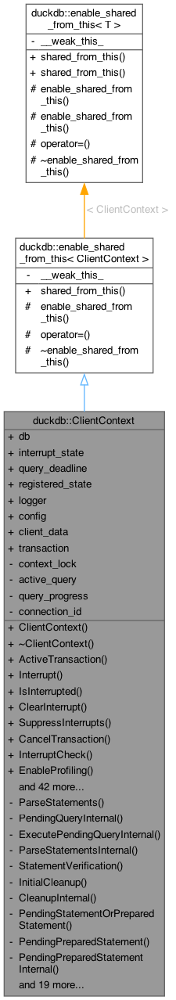
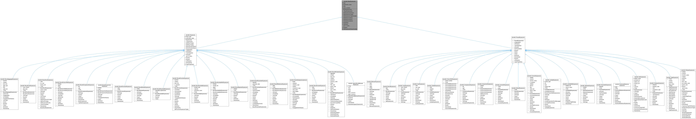
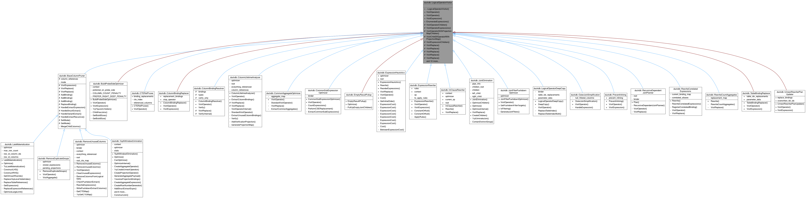
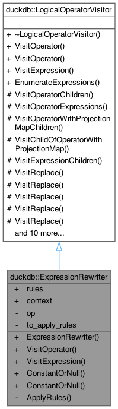
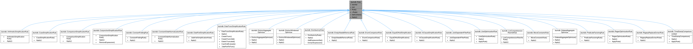

# Software Design Report

## 1. Dependencies

### 1.1 Method

The dependency analysis focuses only on DuckDB's `src/` directory and considers static code dependencies and knowledge dependencies based on Git co-change relations.

### 1.2 Code Dependencies

This analysis captures compile-time coupling caused by `#include` directives. CppDepend and SciTools Understand were used to inspect the project, but a custom Python script was used to obtain a consistent file-level dataset. The script extracted include dependencies between files inside `src/`, excluding standard library headers and external dependencies. In the [resulting tabular dataset](https://docs.google.com/spreadsheets/d/1t4Zn6AM0BTieD4ttUnRgLE4Y9ylnJeGL3xuD3J9N6DU/edit?usp=sharing), outgoing dependencies show which internal DuckDB files are directly included by a file, while incoming dependencies show how many other DuckDB files directly include it. The dataset contains `2804` files: `1387` headers and `1417` implementation files.

The distinction between headers and implementation files is important. Headers have lower outgoing dependencies on average (`3.32`) but much higher incoming dependencies (`10.17`), while implementation files have higher outgoing dependencies (`6.71`) but effectively no incoming dependencies. This is expected since `.cpp` files include headers, while direct inclusion of `.cpp` files is generally avoided. For this reason, incoming degree is more useful for identifying central headers, and outgoing degree is more useful for identifying implementation files that coordinate many DuckDB subsystems.

#### 1.2.1 Dependencies in Header Files

The most depended-on files are central interface and utility headers:

*Figure 1: Header files with the most incoming dependencies.*

The top incoming headers fall into two main groups. The first group is shared infrastructure: `exception.hpp` is the most depended-on header because errors can be raised from almost every DuckDB layer, while `string_util.hpp` and `common.hpp` provide common string operations, constants, helper functions, and basic DuckDB types.

*Figure 2: `exception.hpp` incoming dependencies.*

|  |  |
|-------------------------------------------------------------------------------------------------------------------------|---------------------------------------------------------------------------------------------------------------|
| *Figure 3: `string_util.hpp` incoming dependencies.*                                                                    | *Figure 4: `common.hpp` incoming dependencies.*                                                               |

The second group is core query-processing interfaces. `client_context.hpp` defines the session-level context used for query execution, transactions, configuration, interruption, profiling, and result handling; `binder.hpp` defines the infrastructure that connects parsed SQL to catalog objects, table bindings, expressions, and logical operators. These headers are highly depended on because many subsystems need access to session state or bound query structures.

|  |  |
|---------------------------------------------------------------------------------------------------------------------------------------------|---------------------------------------------------------------------------------------------------------------|
| *Figure 5: `client_context.hpp` incoming dependencies.*                                                                                     | *Figure 6: `binder.hpp` incoming dependencies.*                                                               |

The header files with the highest outgoing dependencies are:

| File                                           | Outgoing Dependencies |
|------------------------------------------------|----------------------:|
| `src/include/duckdb/planner/operator/list.hpp` |                    48 |
| `src/include/duckdb/main/config.hpp`           |                    29 |
| `src/include/duckdb/parser/statement/list.hpp` |                    26 |
| `src/include/duckdb/main/client_context.hpp`   |                    22 |
| `src/include/duckdb/planner/binder.hpp`        |                    20 |

These high-outgoing headers are mostly aggregation or coordination points. `planner/operator/list.hpp` and `parser/statement/list.hpp` collect families of logical operator and SQL statement declarations. `config.hpp` is broad because database configuration touches access mode, memory limits, compression, extensions, logging, storage, replacement scans, and optimizer settings. `client_context.hpp` and `binder.hpp` are central session and binding interfaces.

#### 1.2.2 Outgoing Dependencies in Implementation Files

The implementation files with the most outgoing dependencies are:

*Figure 7: Implementation files with the most outgoing dependencies.*

The top outgoing implementation files are mostly subsystem coordinators. Generated/tooling files are special cases: `enum_util.cpp` is generated by `scripts/generate_enum_util.py`, `serialize_nodes.cpp` is generated serialization code, and `symbols.cpp` exists for LLDB symbol instantiation. These should not be interpreted as ordinary handwritten coupling.

Among handwritten files, `client_context.cpp` and `database.cpp` coordinate session/database state with parsing, planning, execution, transactions, extensions, storage, logging, and scheduling.

|  |  |
|---------------------------------------------------------------------------------------------------------------------------------------|---------------------------------------------------------------------------------------------------------------------------|
| *Figure 8: `client_context.cpp` outgoing dependencies.*                                                                               | *Figure 9: `database.cpp` outgoing dependencies.*                                                                         |

`bind_create.cpp`, `duck_entry_schema.cpp` and `catalog.cpp` coordinate SQL creation and catalog/schema state.

|  |  |  |
|---------------------------------------------------------------------------------------------------------------------------------|---------------------------------------------------------------------------------------------------------------------------------------------|-------------------------------------------------------------------------------------------------------------------------|
| *Figure 10: `bind_create.cpp` outgoing dependencies.*                                                                           | *Figure 11: `duck_schema_entry.cpp` outgoing dependencies.*                                                                                 | *Figure 12: `catalog.cpp` outgoing dependencies.*                                                                       |

`optimizer.cpp` wires together optimizer passes, while execution/storage files such as `physical_hash_join.cpp`, `table_scan.cpp`, `checkpoint_manager.cpp`, `wal_replay.cpp`, and `data_table.cpp` connect operators, filters, table storage, indexes, transactions, serialization, checkpointing, and recovery. Overall, high outgoing degree usually marks a boundary or coordination file rather than an isolated algorithm.

*Figure 13: `optimizer.cpp` outgoing dependencies.*

#### 1.2.3 Files with the Least Code Dependencies

The files with the fewest dependencies are mostly tiny operator headers, compatibility stubs, or small catalog implementation units. Examples include `constant_operators.hpp`, `aggregate_operators.hpp`, `extension_util.hpp`, `dependency_dependent_entry.cpp`, `dependency_subject_entry.cpp`, and `index_catalog_entry.cpp`.

#### 1.2.4 Code Dependencies at Module Level

At module level, the strongest dependency flows are:

| From Module | To Module           | Dependency Pairs |
|-------------|---------------------|-----------------:|
| `common`    | `include/common`    |             1031 |
| `planner`   | `include/planner`   |              649 |
| `parser`    | `include/parser`    |              532 |
| `execution` | `include/execution` |              523 |
| `function`  | `include/common`    |              502 |
| `optimizer` | `include/planner`   |              485 |

Several implementation modules depend heavily on their matching header modules, such as `planner -> include/planner`, `parser -> include/parser`, and `execution -> include/execution`. `include/common` is the strongest shared target, receiving `4995` incoming dependencies in the file-level summary, because DuckDB's common layer provides low-level types, containers, exceptions, constants, filesystem abstractions, and utility functions. The `optimizer -> include/planner` relation is also meaningful because optimizer passes transform logical plans and therefore depend on planner data structures.

### 1.3 Knowledge Dependencies

Knowledge dependencies were measured from Git co-change relations reported in the linked [dataset](https://docs.google.com/spreadsheets/d/1pa1tWlTltAW4g8DvtOI5R4BQnfUC8SB2dUq-Mi9qVB4/edit?usp=sharing) extracted using code-maat. Each row is a pair of files that changed together in the same commits. The `degree` column is the percentage of revisions in which the pair co-changed, while `average-revs` is the average number of revisions of the two files in the pair. To keep the comparison focused on source code, only `.hpp` and `.cpp` files were considered.

After this filter, the co-change dataset contains `2512` pairs. These pairs were compared with the static include dependencies by checking whether either file directly includes the other. `781` co-change pairs also have a direct include dependency, while `1731` do not. So only `31.1%` of the knowledge dependencies are also direct static dependencies.

For the comparison, the most useful examples are pairs connected to files already identified in the static analysis. Some of them are consistent with static dependencies:

| File Pair                                   | Degree | Avg. File Revs | Interpretation                 |
|---------------------------------------------|-------:|---------------:|--------------------------------|
| `enum_util.cpp` / `enum_util.hpp`           |     50 |            420 | generated enum conversion code |
| `client_context.hpp` / `client_context.cpp` |     37 |            379 | broad session interface        |
| `binder.hpp` / `binder.cpp`                 |     40 |            290 | binding infrastructure         |
| `data_table.hpp` / `data_table.cpp`         |     47 |            473 | broad storage class            |

These are implementation/header relations, but they also support the static dependency findings. `client_context`, `binder`, and `data_table` were already identified as central or broad files, and their implementations co-change with their declarations. `enum_util` again needs to be interpreted separately, because it is generated code.

The percentages are not always very high because these files are large interfaces. A commit can change only `client_context.cpp` or only `client_context.hpp`, for example, without changing both. This is why a moderate percentage with many revisions can be more meaningful than a `100%` pair with only a few revisions.

The more interesting cases are co-change pairs that do not have a direct include relation:

| File Pair                                       | Degree | Avg. File Revs | Interpretation                              |
|-------------------------------------------------|-------:|---------------:|---------------------------------------------|
| `data_table.cpp` / `local_storage.cpp`          |     30 |            498 | table storage and transaction-local changes |
| `join_hashtable.cpp` / `physical_hash_join.cpp` |     34 |            473 | hash join implementation split              |
| `row_group.cpp` / `row_group_collection.cpp`    |     33 |            375 | table storage structures                    |
| `config.hpp` / `settings.hpp`                   |     36 |            358 | configuration/settings interface            |
| `config.cpp` / `settings.cpp`                   |     32 |            324 | configuration/settings implementation       |

These are the main co-change relations that are not represented by direct include edges. `data_table.cpp` was already discussed as a high outgoing-dependency implementation file. Its co-change with `local_storage.cpp` shows that table storage and transaction-local changes are maintained together even when the relation is not a direct include edge. The same applies to `row_group.cpp` and `row_group_collection.cpp`, which sit below `DataTable` in the storage layer.

`physical_hash_join.cpp` was also mentioned in the static dependency section. Its co-change with `join_hashtable.cpp` shows the same pattern: one file implements the physical operator and pipeline behavior, while the other implements the hash table mechanics. The configuration pairs are similar. `config.hpp` and `config.cpp` have direct static dependencies, but the co-change data also connects them to `settings.hpp` and `settings.cpp`, because settings declarations, lookup helpers, and configuration registration evolve together.

## 2. Patterns
Four patterns are identified below. Each is verified against the source code and supported by dependency signals from Section 1. Class inheritance diagrams are generated by Doxygen using the build configuration already set up by the project authors.

### 2.1 Facade (Session and Core Access Layer)

**Roles.** [`ClientContext`](https://github.com/duckdb/duckdb/blob/main/src/include/duckdb/main/client_context.hpp) is the Facade; `Connection` is the thin outer shell delegating to it. Subsystems behind the Facade are `Parser`, `StatementPreprocessor`, `QueryProfiler`, and session/transaction state.

**Problem solved.** Callers such as the shell and the C API execute queries without orchestrating the internal pipeline. As Section 1 shows, `client_context.hpp` is among the most depended-on headers in the codebase and `client_context.cpp` is among the most frequently co-changed files, making the Facade the primary change-buffer between callers and the rest of the system.

*Figure 14: `ClientContext` inheritance diagram.*

**Alternative: Mediator.** A Facade is one-directional; subsystems do not know about `ClientContext`. A Mediator would make them bidirectionally aware of a shared coordinator. [`ClientContextState`](https://github.com/duckdb/duckdb/blob/main/src/include/duckdb/main/client_context_state.hpp) already demonstrates this direction via `OnQueryBegin`/`OnQueryEnd` callbacks. Even though this would make subsystem boundaries clearer and lower the risk of a God object, a Mediator solution introduces bidirectional coupling that is harder to trace and risks accumulating its own complexity.

---

### 2.2 Composite (Expression and Plan Tree Model)

**Roles.** [`BaseExpression`](https://github.com/duckdb/duckdb/blob/main/src/include/duckdb/parser/base_expression.hpp) is the Component base. Operator-like nodes (function calls, binary operations, case expressions) are Composites holding child vectors. Constants and column references are Leaves. The Binder, Optimizer, and physical plan generator are Clients traversing the tree uniformly.

**Problem solved.** SQL expressions and plan operators are inherently recursive. The Composite model gives every pipeline stage a uniform traversal interface regardless of nesting depth, eliminating per-level type dispatch. The `planner → include/planner` edge spans 649 dependency pairs, reflecting how deeply this contract is embedded.

*Figure 15: `BaseExpression` inheritance diagram.*

**Alternative: Interpreter.** Interpreter embeds evaluation logic directly in each node via a virtual `Interpret(context)` method. `BaseExpression` already carries per-node predicates (`IsAggregate()`, `IsScalar()`, `IsWindow()`) that hint at this direction. Even though this would make each expression type fully self-contained, cross-cutting operations such as serialisation and constant-folding would require modifying every node class, a problem the current Visitor-based separation handles more cleanly.

---

### 2.3 Visitor (Cross-Cutting Traversal and Rewrite)

**Roles.** [`LogicalOperatorVisitor`](https://github.com/duckdb/duckdb/blob/main/src/include/duckdb/planner/logical_operator_visitor.hpp) is the Visitor base. `ExpressionRewriter` and `ColumnBindingResolver` are concrete Visitors. The logical plan and bound expression trees are the visited Elements. The optimizer/planner workflow is the Client, sequencing Visitors as passes.

**Problem solved.** New traversal operations must be added without modifying tree node classes. All passes — expression rewriting, column binding resolution, lifetime analysis, unused column removal, join elimination — share one traversal contract, keeping node code stable. `optimizer.cpp` is among the top outgoing implementation files identified in Section 1, confirming the Visitor layer is a system-wide standard.

*Figure 16: `LogicalOperatorVisitor` inheritance diagram.*

*Figure 17: `ExpressionRewriter` inheritance diagram.*

**Alternative: Iterator (callback-based traversal).** [`ExpressionIterator`](https://github.com/duckdb/duckdb/blob/main/src/include/duckdb/planner/expression_iterator.hpp) and [`ParsedExpressionIterator`](https://github.com/duckdb/duckdb/blob/main/src/include/duckdb/parser/parsed_expression_iterator.hpp) already exist in the codebase and use `std::function` callbacks instead of a class hierarchy — this is already used as a production design for expression-level traversal today. Extending it to operator traversal would replace Visitor subclasses with lambdas. Even though this eliminates class boilerplate and makes passes composable, mutable closure state is harder to inspect than named visitor fields and compile-time visitor protocol guarantees are lost.

---

### 2.4 Strategy (Rule-Based Optimizer Behaviour)

**Roles.** [`Rule`](https://github.com/duckdb/duckdb/blob/main/src/include/duckdb/optimizer/rule.hpp) is the Strategy interface, holding an `ExpressionMatcher` and declaring `Apply`. Concrete Strategies are `ConstantFoldingRule`, `ArithmeticSimplificationRule`, `CaseSimplificationRule`, and others under `src/optimizer/rule/`. [`ExpressionRewriter`](https://github.com/duckdb/duckdb/blob/main/src/include/duckdb/optimizer/expression_rewriter.hpp) is the Context iterating and applying them.

**Problem solved.** The optimizer must apply an independently growing set of rewrite behaviours without coupling them to traversal infrastructure. Strategy encapsulates each rewrite separately so new rules are purely additive. With `optimizer.cpp` among the highest outgoing implementation files and `binder.hpp` among the most depended-on headers identified in Section 1, rule-level stability matters at system scale.

*Figure 18: `Rule` inheritance diagram.*

**Alternative: Chain of Responsibility.** The [`ApplyRules`](https://github.com/duckdb/duckdb/blob/main/src/optimizer/expression_rewriter.cpp) loop in `ExpressionRewriter` already tries rules in sequence and applies the first match — semantics close to a chain. A formal Chain of Responsibility would give each `Rule` a `next` pointer, making ordering an explicit structural contract rather than a vector-position convention. Even though this keeps the handle-or-pass decision within the rule itself and makes ordering explicit, linked chains are harder to debug than a flat vector and adding `next` to the `Rule` interface complicates stateless rule reuse.

## 3. Summary